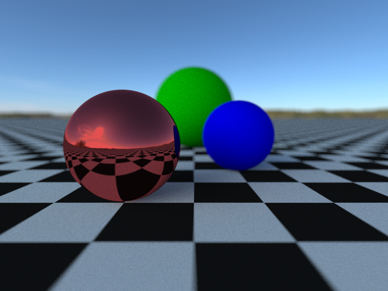

# c-trace

Toy raytracer written in C

Traced images are sent to standard output and can either be redirected to a file
or piped to an image viewer or other program that supports reading an image from
standard input.

An example scene file is given in `example.esc`, and the image below was
generated by the command
```
c-trace -g800x600 -s400 -b4 example.esc > example.png
```



## Features

- anti-aliasing
- depth of field
- texture sampling (only on planes and background for now)
- environment map importance sampling
- mirror and diffuse materials

## Future Goals

- support for arbitrary models
- more advanced materials
- acceleration structures
- emissive surfaces and multiple importance sampling
- HDR tonemapping
- OpenColorIO integration

## Dependencies

- [libpng](http://www.libpng.org/pub/png/libpng.html)

